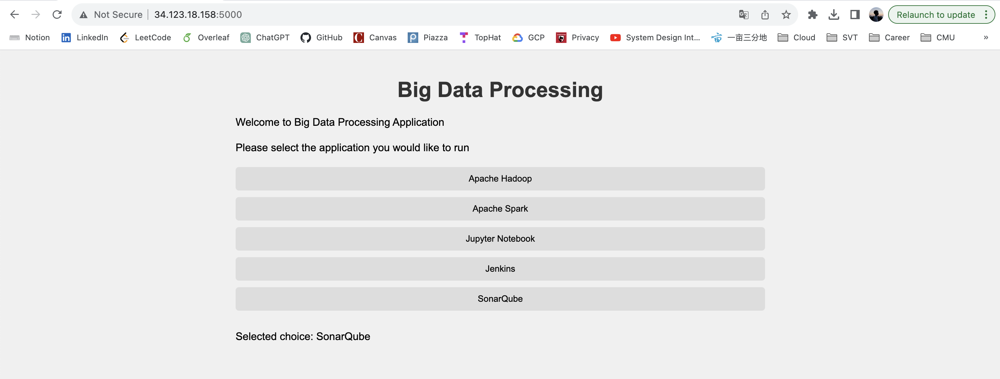
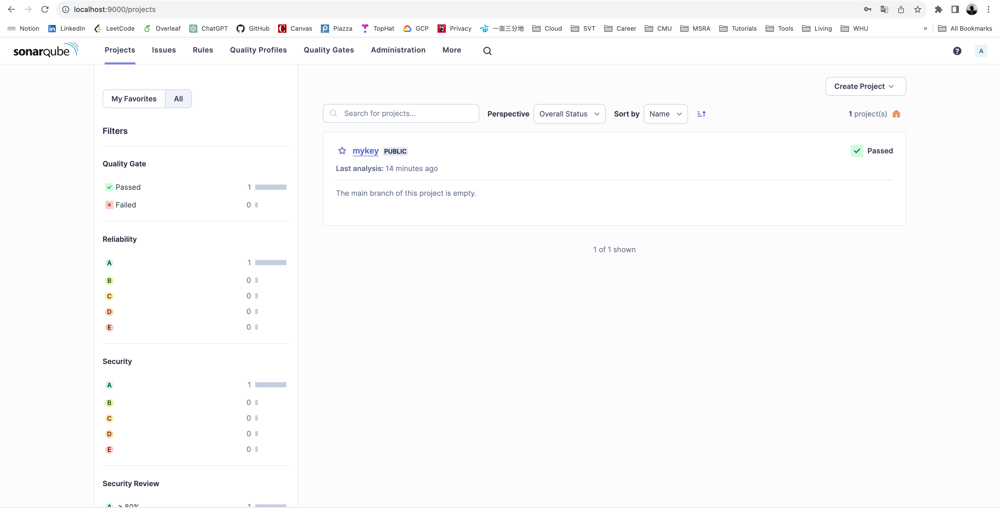
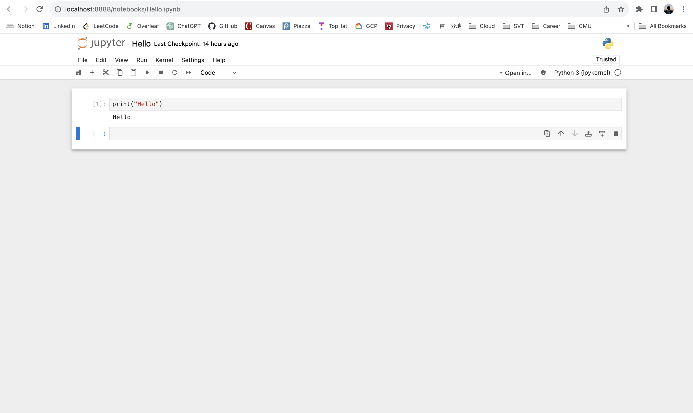
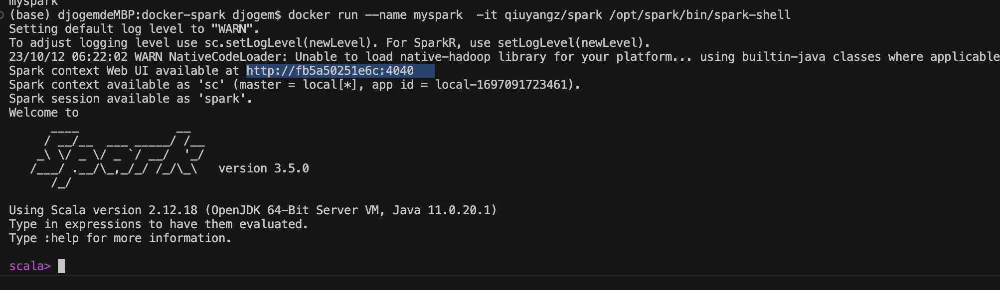
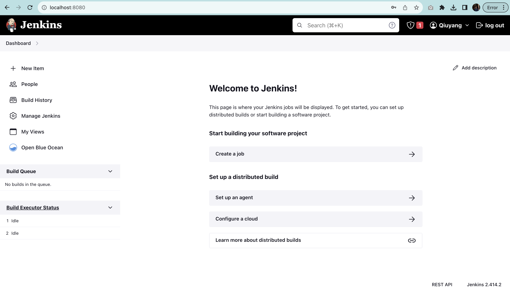

[](https://classroom.github.com/a/gmvPxYB2)


Yaokang Wu - yaokangw@andrew.cmu.edu

Qiuyang Zhang - qiuyangz@andrew.cmu.edu

# Web Application

## Run app locally

```bash
cd app
python -m venv venv
source venv/bin/activate
pip install -r requirements.tx
```

```bash
python app.py
```

[Web App image](https://hub.docker.com/r/yaokangw/data-app)



## Run app on Docker


```bash
docker build -t yaokangw/data-app .
docker run --name data-app -p 5000:5000 -d yaokangw/data-app
```

# Images

## SonarQube

[SonarQube image](https://hub.docker.com/_/sonarqube)

[SonarQube documentation](https://docs.sonarsource.com/sonarqube/latest/setup-and-upgrade/install-the-server/)

```bash
docker run -d --name sonarqube -e SONAR_ES_BOOTSTRAP_CHECKS_DISABLE=true -p 9000:9000 sonarqube:latest
```

## SonarScanner

[SonarScanner image](https://hub.docker.com/r/sonarsource/sonar-scanner-cli)

[SonarScanner documentation](https://docs.sonarsource.com/sonarqube/latest/analyzing-source-code/scanners/sonarscanner/)

```bash
docker run  --rm --network=host -e SONAR_HOST_URL="http://127.0.0.1:9000" -e SONAR_SCANNER_OPTS="-Dsonar.projectKey=dummy" -e SONAR_TOKEN="squ_3d972dd73f4e3a7abf386ae9eda5c70ee05b683a" -v "https://github.com/Hallimede/dummy-project" sonarsource/sonar-scanner-cli
```



## Jupyter

[Jupyter base image](https://hub.docker.com/r/jupyter/base-notebook)

[Jupyter custom image](https://hub.docker.com/repository/docker/yaokangw/jupyter-notebook/general)

[Jupyter documentation](https://jupyter-docker-stacks.readthedocs.io/en/latest/index.html)

```
docker run --name jupyter -d -p 8888:8888 yaokangw/jupyter-notebook
```




## Spark

[Spark base image](https://hub.docker.com/layers/apache/spark/latest/images/sha256-a4a48089219912a8a87d7928541d576df00fc8d95f18a1509624e32b0e5c97d7?context=explore)


[Spark custom image](https://hub.docker.com/layers/qiuyangz/spark/latest/images/sha256-3809b9a329db6b13278661155941c7aad31e7d94abd39692d9cd1f562ded3043?context=repo)





## Hadoop

[Hadoop base image](https://hub.docker.com/layers/apache/hadoop/3/images/sha256-af361b20bec0dfb13f03279328572ba764926e918c4fe716e197b8be2b08e37f?context=explore)

[Hadoop custom image](https://hub.docker.com/layers/qiuyangz/myhadoop/latest/images/sha256-af361b20bec0dfb13f03279328572ba764926e918c4fe716e197b8be2b08e37f?context=repo)


## Jenkins

[Jenkins base image](https://hub.docker.com/layers/jenkins/jenkins/2.414.2-jdk17/images/sha256-8f8122dca2bce1df41da1cbeb8976f2603af6b76928f3bfcc6446e6a6eb126d4?context=explore)

[Jenkins custom image](https://hub.docker.com/layers/qiuyangz/myjenkins/latest/images/sha256-47cb6d1b01bf90535e1f7e9ff377ec07db4792328ca238425ecf181a740289a9?context=repo)



