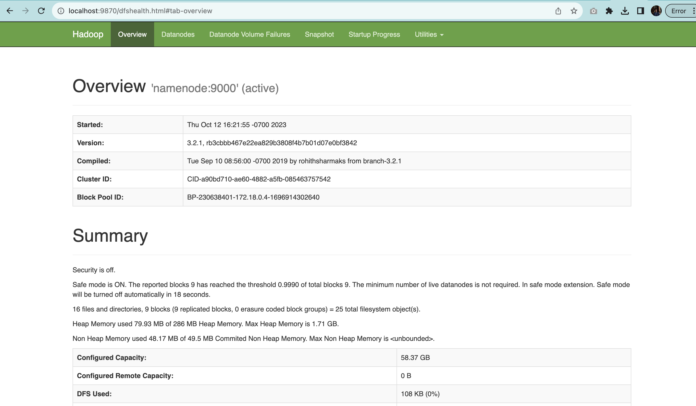
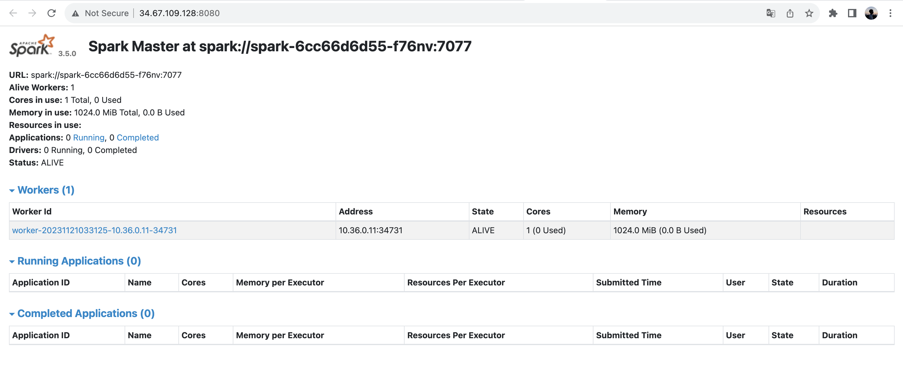

[](https://classroom.github.com/a/gmvPxYB2)

# Big Data Processing

## Team

Yaokang Wu - yaokangw@andrew.cmu.edu

Qiuyang Zhang - qiuyangz@andrew.cmu.edu


## Deployment

1. Add Google Cloud Platform credentials json file in `terraform.json`.

2. Execute the following command:

    ```bash
    $ terraform init
    $ terraform apply
    ```

3. After the terraform finished, navigate to the frontend ip address with corresponding port and you are good to go.

    For the Jenkins application, after Sonarqube server is started,

    

    go to the dashboard and run the pre-configured [DummyProject](https://github.com/Hallimede/dummy-project) job.

    

    

    Then you can see both the successful build in Jenkins and result report in Sonarqube. 


# Microservices

The architecture for this application is like the following diagram:


1. Frontend App

   - Docker hub image: https://hub.docker.com/repository/docker/yaokangw/data-app

   - Dockerfile: [app/Dockerfile](app/Dockerfile)

   - Command to run it:
        ```bash
        $ docker run --name data-app -d -p 5000:5000 yaokangw/data-app
        ```

   - Kubernetes Deployment file: [scripts/frontend-deployment.yaml](scripts/frontend-deployment.yaml)

   - Kubernetes Service file: [scripts/frontend-lb.yaml](scripts/frontend-lb.yaml)

   - Screenshot:

        

2. Jupyter Notebook

   - Docker hub image: https://hub.docker.com/repository/docker/yaokangw/jupyter

   - Dockerfile: [jupyter/Dockerfile](jupyter/Dockerfile)

   - Command to run it:
        ```bash
        $ docker run --name jupyter -d -p 8888:8888 yaokangw/jupyter-notebook
        ```

   - Kubernetes Deployment file: [scripts/jupyter-deployment.yaml](scripts/jupyter-deployment.yaml)

   - Kubernetes Service file: [scripts/jupyter-lb.yaml](scripts/jupyter-lb.yaml)

   - Screenshot:

        


3. SonarQube

   - Docker hub image: https://hub.docker.com/r/yaokangw/sonarqube

   - Dockerfile: [sonarqube/Dockerfile](sonarqube/Dockerfile)

   - Command to run it:
        ```bash
        $ docker run -d --name sonarqube -e SONAR_ES_BOOTSTRAP_CHECKS_DISABLE=true -p 9000:9000 sonarqube:latest
        ```

   - Kubernetes Deployment file: [scripts/sonarqube-deployment.yaml](scripts/sonarqube-deployment.yaml)

   - Kubernetes Service file: [scripts/sonarqube-deployment.yaml](scripts/sonarqube-deployment.yaml)

   - Screenshot:

        

4. Jenkins

   - Docker hub image: https://hub.docker.com/r/yaokangw/jenkins

   - Dockerfile: [jenkins/Dockerfile](jenkins/Dockerfile)

   - Command to run it:
        ```bash
        $ docker run -d -p 8080:8080 -p 50000:50000 yaokangw/jenkins:sonar /usr/local/bin/jenkins.sh
        ```

   - Kubernetes Deployment file: [scripts/jenkins-deployment.yaml](scripts/jenkins-deployment.yaml)

   - Kubernetes Service file: [scripts/jenkins-lb.yaml](scripts/jenkins-lb.yaml)

   - Screenshot:

        


To be modified

5. Hadoop
    Since the requirement specifies one master node and two worker nodes for Hadoop, we have one name node and two datanodes, resulting in a total of three deployment files.

    - Hadoop Docker hub image: https://hub.docker.com/layers/bde2020/hadoop-namenode/2.0.0-hadoop3.2.1-java8/images/sha256-51ad9293ec52083c5003ef0aaab00c3dd7d6335ddf495cc1257f97a272cab4c0?context=explore
    
    - Kubernetes hadoop namenode Deployment file: [scripts/namenode-deployment.yaml](scripts/namenode-deployment.yaml)

    - Kubernetes hadoop datanode1 Deployment file: [scripts/datanode1-deployment.yaml](scripts/datanode1-deployment.yaml)

    - Kubernetes hadoop datanode2 Deployment file: [scripts/datanode2-deployment.yaml](scripts/datanode2-deployment.yaml)

    - Kubernetes hadoop resourcemanager Deployment file: [scripts/resourcemanager-deployment.yaml](scripts/resourcemanager-deployment.yaml)

    - Kubernetes hadoop namenode Service file: [scripts/namenode-service.yaml](scripts/namenode-service.yaml)

    - Screenshot: 
        

6. Spark

    There is no specified requirement regarding the number of workers for Spark, so we assume that one master node and one worker node will be sufficient. Here is a list of deployment files and service files used for the spark master and spark worker.

    - Spark Docker hub image: https://hub.docker.com/layers/bitnami/spark/3.5/images/sha256-94e06ae46bc7fab045b628f10311004865d753837f66a92009ccfd1040628209?context=explore 

    - Kubernetes spark master Deployment file: [scripts/spark-deployment.yaml](scripts/spark-deployment.yaml)

    - Kubernetes spark worker Deployment file: [scripts/spark-worker-deployment.yaml](scripts/spark-worker-deployment.yaml)

    - Kubernetes spark Service file: [scripts/spark-service.yaml](scripts/spark-service.yaml)

    - Screenshot:
        


# Reference


- Jenkins

    - Jenkins Configuration as Code Plugin Documentation [(Link)](https://github.com/jenkinsci/configuration-as-code-plugin/tree/master)

    - Configure sonar plugin in jenkins - Github [(Link)](https://github.com/jenkinsci/configuration-as-code-plugin/blob/master/demos/sonarqube/README.md)

    - Setting up Dockerized Jenkins and SonarQube in Linux Environment - Medium [(Link)](https://faun.pub/setting-up-dockerized-jenkins-and-sonarqube-in-linux-environment-155ce52b884a)

    - Disable Access Control - Jenkins [(Link)](https://www.jenkins.io/doc/book/security/access-control/disable/)

    - Option 1 Sample Solution Jenkins Dockerfile - Sankalp, Kishan [(Link)](https://github.com/Cloud-Infrastructure-Fall-2023/option-1-sample-solution/blob/main/jenkins-sonarqube-sonarscanner/Dockerfile)

- Sonarqube

    - Installing SonarQube from the Docker image - SonarQube [(Link)](https://docs.sonarsource.com/sonarqube/latest/setup-and-upgrade/install-the-server/)

    - Allow anonymous authentication on SonarQube 8.6 - StackOverflow [(Link)](https://stackoverflow.com/questions/65270209/allow-anonymous-authentication-on-sonarqube-8-6)

    - SonarQube with Jenkins Setup using Docker Images - FunnelGarden [(Link)](https://funnelgarden.com/sonarqube-jenkins-docker/)


- Hadoop
    - Namenode format issue - StackOverflow [(Link)](https://stackoverflow.com/questions/61694471/hdfs-namenode-format-issue-with-aws-ebs-in-eks-cluster)

    - Multi-attach error for pvc volume - StackOverflow [(Link)](https://stackoverflow.com/questions/70945223/kubernetes-multi-attach-error-for-volume-pvc-volume-is-already-exclusively-att)

    - How to create a storageclass that allows ReadWriteMany -- nfs filestore - StackOverflow [(Link)](https://stackoverflow.com/questions/54796639/how-do-i-create-a-persistent-volume-claim-with-readwritemany-in-gke)

    - Persistent Volume - Kubernetes [(Link)](https://kubernetes.io/docs/concepts/storage/persistent-volumes/)


- Spark
    - Spark Standalone cluster Documentation - Spark[(Link)](https://spark.apache.org/docs/latest/spark-standalone.html)
    - Deploy Spark Cluster with Kubernetes - Medium [(Link)](https://medium.com/rahasak/spark-cluster-deployment-with-kubernetes-1848d061cfc9)
    - Example to set up Spark environment variables - Medium [(Link)](https://medium.com/@SaphE/testing-apache-spark-locally-docker-compose-and-kubernetes-deployment-94d35a54f222)
